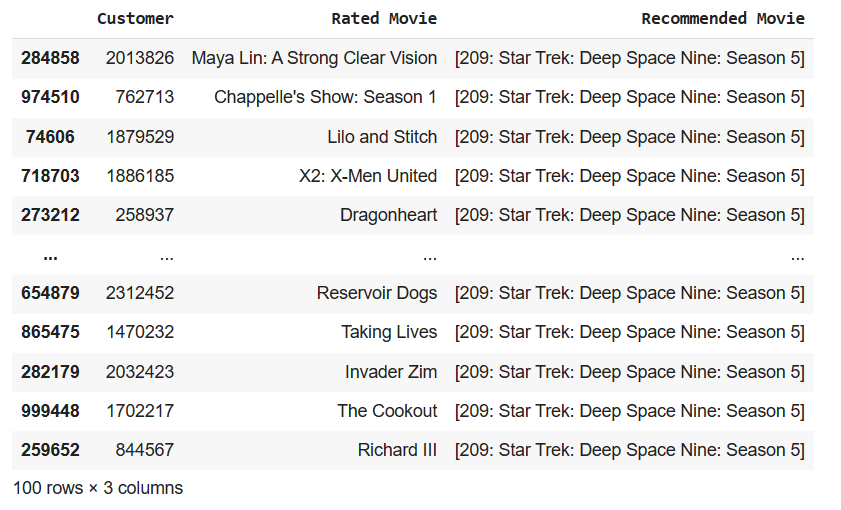

# Objective
The goals of this project were to:
1. Predict the rating a given customer would give to a movies they had not yet rated.
2. Recommend a customer a new movie that they would likely enjoy.

Experiment 1's objective was to experiment with different recommender engine methods to recommend one movie to a given user given the movie they just rated.

Experiment 2's objective was to estimate the ratings a user would give to movies. Select algorithms were then used to generate movie recommendations.

# Exploratory Data Analysis
Data were obtained from a [Kaggle challenge](https://www.kaggle.com/netflix-inc/netflix-prize-data
) using the same data as the Netflix Prize. 

The data consisted of:
* Movie ratings: customer ID number, rating from 1-5 (integer), movie ID number, and rating date.
* Movie information: movie ID and title.

Overall, a majority of ratings were from 3-5 (mean = 3.6, standard deviation = 1.1). The distribution of the ratings can be seen in the bar charts in the left panels of the `Experiment 2` figures below.

Due to computational limitations, most of the analyses were performed on only a subset of movie ratings.

# Experiment 1

To compare the quality of the recommended movies amongst the different recommender engine methods, one recommendation was generated by each method for each of 100 random customer ratings (customer ID + rated movie). It is assumed that a good recommender engine would take into account the movies that the customer had rated such that if the 100 ratings included several different movie titles, the recommendations would also include several different movie titles. Thus, the metric for evaluating recommender systems was the ratio of number of movie titles in the probe sample to the number of recommended movie titles in the resulting recommendations.

Scikit Surprise models were trained on all available data. Most of the remaining recommender engine methods were based on data for the first 1 million ratings in the `combined_data_1.txt` file. However, due to computational limitations, some of the methods were based on fewer ratings. 

. | Algorithm | Number of samples used in training | Number of movies in test sample* | Number of recommended movies based on test sample* | Recommended to input ratio | 
--- | --- | --- | --- | --- | --- |
`Scikit Surprise` | `NMF` | 100,480,507 | 31 | 28 | 0.90
`Scikit Surprise` | `SVD` | 100,480,507 | 31 | 26 | 0.84
Memory-based collaborative filtering: user-to-user | KNeighbors | 1,000,000 | 31 | 37 | **1.19**
Memory-based collaborative filtering: item-to-item | KNeighbors | 1,000,000 | 31 | 17 | 0.55
Memory-based collaborative filtering: item-to-item | Cosine similarity | 1,000,000 | 31 | 1 | 0.03
`randomizedSVD` (n_components=500) | cosine similarity using items matrix | 100,000 | 17 | 3 | 0.18
Content-based filtering | `Apyori` | 500,000 | 35 | 18 | 0.51
Content-based filtering | `Word2Vec` | 500,000 | 35 | 28 | 0.8

 

**Test sample size = 100*

 

# Experiment 2
## Methods
### Method I: `scikit Surprise`
Initially, using a train-test split using all ratings data (100,480,507 samples), the following three algorithms in the `scikit Surprise` package were compared:
* `SVD`
* `SVDpp`: This algorithm could not be executed with the data set due to computational limitations.
* `NMF`

### Method II: Classic Machine Learning

For all movies not yet rated by a customer, the rating was estimated according the following formula:

*rating = average of all given ratings + bias for the customer + bias for the movie*

* bias for the customer = mean rating for the customer - mean rating for all customers
    * Positive value indicates that the customer tends to give higher ratings than other users
* bias for the movie = mean rating for the movie - mean rating for all movies
    * Positive value indicates that the movie tends to be rated higher than other movies

This average-based rating estimation was then used as a feature in various classic machine learning regression and classification models. Because all ratings were integers, classification models were included to see if they would result in less error than regression models.

## Results
### Rating Estimation

Metric | Average-Based Model | OLS Regression | Logistic Regression | Random Forest Classifier |  Surprise NMF | Surprise SVD
--- | ---- | --- | --- | --- | --- | ---
Cross-validated RMSE | 0.88 | **0.79** | 0.87 | 1.18 | 1.1468 | 0.9858
Cross-validated MAE  | 0.6825 | 0.6073 | 0.5707 | 0.8333 | 0.9086 | 0.7748
Cross-validated R^2  | 0.3335 | **0.4515** | 0.3509 | -0.2235 | -0.1381 | 0.1591

### Movie Recommendations

In terms of estimating ratings for a given user and movie:
* OLS regression (`LinearRegression`) performed the best of all models tested.
* The `SVD` algorithm performed best of the `Surprise` algorithms tested.
* The `NMF` algorithm performed the worst of all models.

However, when these models were used to recommend a new movie to a user based on top predicted rating, models that performed better in terms of traditional model evaluation metrics (R^2 score and RMSE) tended to have less diverse movie recommendations. In other words, the model that had the lowest prediction error recommended the same movie to most customers.

Expand for example recommendations from each method 

#### `LinearRegression`:

#### `Surprise SVD`:

#### `Surprise NMF`:

 

. | Number of samples used in training | Number of movies in test sample* | Number of recommended movies based on test sample* | Recommended to input ratio | 
--- | --- | --- | --- | --- |
Surprise NMF | 100,480,507 | 31.0 | 28.0 | **0.90**
Surprise SVD | 100,480,507 | 31.0 | 26.0 | 0.52
Linear Regression | 1,000,000 | 31.0 | 3.0 | 0.10

# Conclusions

In terms of estimating ratings for a given user and movie, an ordinary least squares regression model (with average-based rating estimation as features) performed the best (i.e. provided rating estimations with the lowest RMSE and highest R^2 score). However, user-to-user memory-based collaborative filtering provided the highest diversity in movie recommendations and may more accurately account for diversity in customer preferences.

# Challenges

It is unclear what would be the best method to evaluate the recommender systems: Models that performed the best in terms of traditional evaluation metrics tended to provide lower diversity in movie recommendations.

Other challenges included:
* Non-normal distribution of the target variable: there is a left skew in the ratings and most ratings were 3-4. As a result, the models tended to overestimate ratings when the true ratings were 1-2 and underestimate ratings when the true ratings were 5.
* Sparse utility matrix: Most users only rated 1 movie, which likely meant that many users and items were similar to each other when cosine similarity was used as a distance metric. 

# Lessons
* Always perform the exploratory data analysis.
* Look at the data in intermediate steps (e.g similarity matrix)

# Possible Next Steps
* See if a deep learning model would perform better.
* Experiment with multi-variate regressions with different feature engineering/feature selection.

