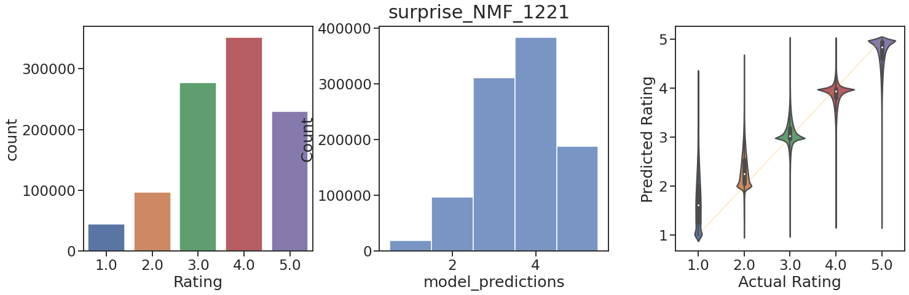

# Objective
The goals of this project were to:
1. Predict the rating a given customer would give to a movies they had not yet rated.
2. Recommend a customer a new movie that they would likely enjoy.

# Exploratory Data Analysis
Data were obtained from a [Kaggle challenge](https://www.kaggle.com/netflix-inc/netflix-prize-data
) using the same data as the Netflix Prize. 

The data consisted of:
* Movie ratings: customer ID number, rating from 1-5 (integer), movie ID number, and rating date.
* Movie information: movie ID and title.

Due to computational limitations, most of the analyses were performed on only a subset of movie ratings.

# Approach
* Experiment 1's objective was to experiment with different recommender engine approaches to recommendone movie to a given user given the movie they just rated.
* Experiment 2 used findings from Experiment 1 to inform model selection for estimating movie ratings.

# Results
Metric | Average-Based Model | OLS Regression | Logistic Regression | Surprise NMF
--- | ---- | --- | --- | ---
Cross-validated RMSE | 0.88 | 0.79 | 0.87 | 1.1468
Cross-validated MAE  | 0.6825 | 0.6073 | 0.5707 | 0.9086
Cross-validated R^2  | 0.3335 | 0.4515 | 0.3509 | -0.1381

# Future Goals
See if a deep learning model would perform better.